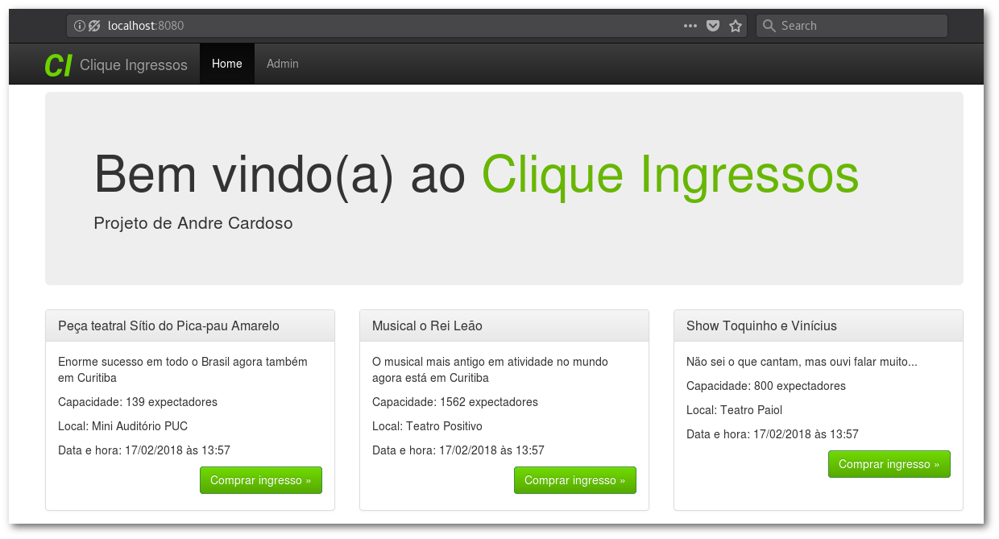

# Candidato

**Nome**: Andre Cardoso

**Email**: andrecardosodev@gmail.com

# Instalação

Baixe o repositório no branch `andre-cardoso` e rode o comando `composer install`. Caso 
não de certo com o install, dê um update: `composer update`.

Assim que a instalação das dependências finalizar siga um dos passos abaixo.

## Rodando pelo Built-in Server do PHP

### Passo 1 - Criando o banco de dados

Crie um novo banco de dados MySQL. Sugestão de nome: `sae_andre_cardoso`. Em seguida configure o 
arquivo `config/autoload/doctrine-module` com as informações do banco recém criado.

```php
# config/autoload/doctrine_orm.global.php

return [
    'doctrine' => [
        'connection' => [
            'orm_default' => [
                'driverClass' => 'Doctrine\DBAL\Driver\PDOMySql\Driver',
                'params' => [
                    'host' => 'localhost',
                    'port' => '3306',
                    'user' => 'user',
                    'password' => 'password',
                    'dbname' => 'sae_andre_cardoso',
                    'driverOptions' => [
                        PDO::MYSQL_ATTR_INIT_COMMAND => "SET NAMES 'UTF8'"
                    ]
                ]
            ]
        ]
    ],
];

```

### Passo 2 - Executando Migrations

Agora que o banco de dados já existe e a configuração para sua correta conexão está ok, 
é o momento de criar as tabelas. Para tal, utilizei o Doctrine Migrations (você pode saber mais sobre 
migrations com o Doctrine em um artigo que escrevi em meu blog - [link](https://andrebian.com/doctrine-migrations-com-zend-framework)).

Em resumo, o comando a ser executado é o `./vendor/bin/doctrine-module migrations:migrate --no-interaction`.


### Passo 3 - Executando Fixtures

Por padrão já cadastrei 3 eventos/espetáculos, basta rodar as fixtures que a aplicação estará pronta para uso. 
Rode o comando `./vendor/bin/doctrine-module orm:fixtures:load`.


```shell
$ ./vendor/bin/doctrine-module orm:fixtures:load
Careful, database will be purged. Do you want to continue y/N ?y
  > purging database
  > loading [0] Application\Fixture\LoadEvent
```

### Passo 4 - Rode o Built-in Server

Agora basta rodar o comando `php -S localhost:8080 -t public`. Adicionalmente existe um script registrado no composer.json 
pra facilitar a disponibilização do web server de testes: `composer serve`

```shell
$ php -S localhost:8080 -t public
```

Resultado




# Observações
[...]

# Testes

Para rodar os testes, utilize o comando `composer test`. Toda a suíte de 
testes será executada e, estando o Xdebug instalado, será gerado o 
resultado do coverage na pasta `build/coverage-html`. Abra o arquivo 
`build/coverage-html/index.html` em seu navegador.